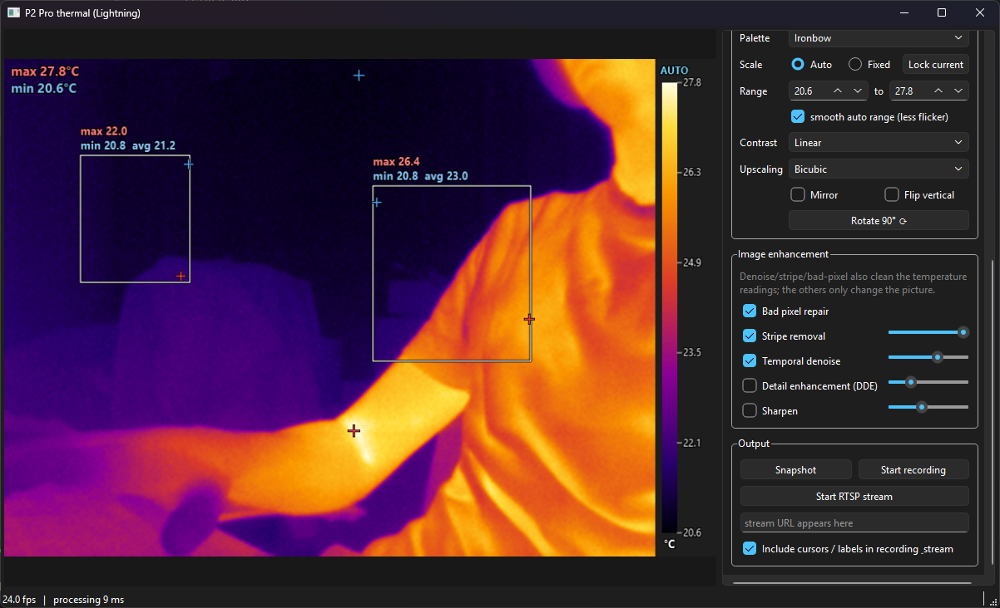
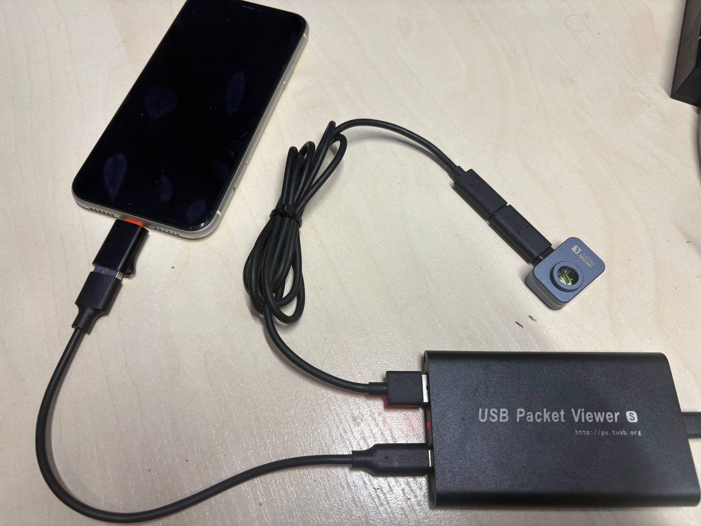

# p2pro-ios-viewer

A Python app for using the **Thermal Master P2 Pro with the Lightning (iOS) connector on a Windows PC**:
live image, temperature cursors and boxes, image enhancement, recording and RTSP streaming.



> [!CAUTION]
> **This project was completely vibe-coded.** All the code, the reverse engineering and this README
> were produced by an AI assistant (Claude) in a chat session; the author supplied the hardware,
> tested it and steered. Treat it as an experiment, not as reviewed software.

> [!WARNING]
> **Tested with exactly one camera**: a Thermal Master P2 Pro with the **Lightning** connector
> (USB ID `0BDA:5840`, USB strings "infisense" / "P2 Pro"), on Windows 11. Nothing else was tried:
> not other P2 Pro units, not the USB-C version, not other operating systems.
> The startup sequence in `init_cmds.json` was recorded from that one camera, so it may not work
> for other units (see [How it was done](#how-it-was-done)).
> **Temperature readings have not been checked against any reference** (see [Temperatures](#temperatures)).

Background: the camera works on an iPhone. On the test PC the vendor's Thermal Master app showed
"no camera" for it. The camera doesn't present itself as a webcam; it speaks Apple's **iAP2**
accessory protocol. This app gets it streaming by playing the iPhone's role.

## Running

```
pip install pyusb libusb-package numpy opencv-python PySide6
python app.py              # full app with side panel
python viewer.py           # minimal OpenCV-only viewer
```

* The camera shows up as `USB\VID_0BDA&PID_5840`. It was tested with the **libusbK** driver, which on
  the test PC had been installed by the Thermal Master PC app (its `drivers/inf/P2Pro.inf`). Close
  Thermal Master before starting.
* **Unplug and replug the camera before every start.** After a session ends, the camera didn't
  answer a new handshake in our tests until it was power-cycled.
* Recording and RTSP need **ffmpeg** on PATH. RTSP also needs MediaMTX: `python tools/get_mediamtx.py`.

### App features (`app.py`)
* **Measurement**: click = temperature cursor, drag = rectangle (max / min / average, hottest and
  coldest points marked), right click = delete; clear buttons; global hottest/coldest markers;
  center crosshair; °C / °F; temperature calibration (see below).
* **Display**: 9 palettes; auto scale (coldest pixel = bottom of the scale, hottest = top) or fixed
  range, "Lock current" freezes the current auto range; contrast mapping linear / plateau histogram
  equalization / CLAHE; mirror / flip; rotate in 90° steps (cursors and rectangles rotate along).
* **Image enhancement**: bad-pixel repair, stripe (row/column noise) removal, motion-adaptive temporal
  denoise (these three are applied before the temperature conversion, so they affect readings);
  detail enhancement (DDE), sharpening and upscaling: nearest / bicubic / Lanczos / **ESPCN neural
  super-resolution ×2 / ×3 / ×4** (these only change the picture). With a non-linear contrast mode
  (histogram / CLAHE) the colour bar labels don't map linearly to the colours.
* **Output**: snapshot (PNG + CSV with every pixel's temperature, `snapshots/`), MP4 recording
  (`recordings/`), **RTSP stream** at `rtsp://<pc-ip>:8554/thermal` (URL shown in the panel).
* Settings are saved in `settings.json`. Keyboard shortcuts: Del = clear all, S = snapshot,
  C = shutter calibration, R = rotate 90°, A = auto/fixed scale, Esc = cancel calibration.

**Testing:** the author used `app.py` with the real camera. The RTSP stream was only received by an
ffmpeg client on the same PC, not from another device.

### Temperatures

The camera delivers raw sensor values (0–16383) that **decrease** as temperature rises. The iOS
app's memory reads in the capture (4 of them) returned only `FF` bytes, and no conversion data was
found. The app therefore uses a linear model:

    T = offset + gain * (shutter_reference - raw)

The defaults (`gain` 0.012 °C per count, `offset` 28 °C) are rough estimates: the gain assumes a
sensor noise level of 40 mK, which wasn't measured. **The readings have not been compared with any
reference, so their error is unknown.**

To calibrate: *Calibrate temp...* in the app (`k` in `viewer.py`), click a spot, and enter its real
temperature. One point sets the offset; a second point at a different temperature also sets the
gain. Stored in `calib.json`. The calibration hasn't been checked against objects of known temperature.

## How it was done

1. **USB descriptors.** The camera has no UVC (webcam) interfaces. It has a vendor interface named
   *iAP Interface* and a second one named `com.xinfrared.pios1`.
2. **Playing the iPhone.** A small iAP2 implementation in Python (`iap2.py`) gets through the link
   handshake, authentication and identification. The camera accepted our "authentication
   succeeded" without us checking its certificate, so no Apple hardware was needed. On the data
   channel the camera answered a few info commands, but blind probing didn't find a way to start
   the video.
3. **Sniffing the iPhone.** A [USB Packet Viewer](http://pv.tusb.org) hardware analyzer was placed
   between an iPhone and the camera while the official iOS app showed the image:

   

   *iPhone (Lightning-to-USB adapter) → analyzer **HOST** port, camera (via its Lightning adapter and an
   extension cable) → analyzer **DEVICE** port, analyzer → PC.* SOF / NAK / PING packets were dropped by
   the analyzer to keep the capture small. Capture script: `tools/capture.py`; the capture is
   `capture/capture.bin`.
4. **Decoding the capture** (`tools/decode.py`, `tools/dump.py` → `capture/dump.txt`). It contains
   1151 commands the iOS app sends before video starts, the commands it sends periodically during
   streaming, and the video stream itself.
5. **Sending it.** The app sends the same 1151 commands, decodes the stream, subtracts a
   closed-shutter reference frame and converts to temperatures.

> [!NOTE]
> `capture/capture.bin` contains the **thermal video** recorded during that iPhone session (about
> 400 frames), and anyone can extract it with the decoding tools in `tools/`.
> `experiments/*.png` are frames from it.

## Protocol notes

Everything here was observed in the capture or on the camera, except where marked
**interpretation**: that's a reading of the data that was not proven.

### USB layout (`0BDA:5840`)
| interface | purpose | endpoints |
|---|---|---|
| 0 "iAP Interface" (class FF/F0/00) | iAP2 link | OUT 0x05, IN 0x86 |
| 1 "com.xinfrared.pios1" (FF/F0/01), alt 1 | data channel (commands + video) | IN 0x82, OUT 0x07 |

### iAP2 handshake (`iap2.py`)
Detect bytes `FF 55 02 00 EE 10` → link SYN / SYN+ACK → the host asks for the accessory's
certificate and a challenge response; we send AuthenticationSucceeded without checking them →
StartIdentification → IdentificationAccepted. The camera then sends message `0xEA02` containing
`com.xinfrared.p2pro`, which we ignore. In the capture, the iPhone never sends
StartExternalAccessoryProtocolSession; it selects **alt setting 1 on interface 1** and starts
writing commands.

### Data channel
Requests: `[length][command][params...]` on OUT 0x07. Short replies on IN 0x82 look like
`[len] 86 [status] ...`. Command `15` returns readable strings (`INFI-0002`, `CE2.131.12`, the serial
number, `infisense`). Interpretation, from probing: status 01 = OK, 80 / 84 = parameter rejected,
82 = unknown command; `03` returns a version, `05` returns a table that looks like webcam
image-control ranges.

What the iOS app sent before the video started (the 1151 commands in `init_cmds.json`, counted):
* 2 info queries: `02 03`, `02 05`
* 131 commands `05 12 <3 bytes>`, 100 of them of the form `05 12 00 <byte> <byte>`
  (interpretation: register writes)
* 1013 commands with command byte `1b`: 808 × `24 1b <addr16> <32 bytes>`, 202 × `06 1b <4 bytes>`,
  3 × `05 1b <3 bytes>` (interpretation: a table upload, possibly data specific to this unit)
* 3 commands `06 1e ...` (the same command family as the shutter commands below)
* `08 01 01 01 04 00 cc 19`, whose parameters equal the payload that command `03` returns
* `03 02 01` (last), after which video packets arrive. Whether this command alone starts the
  stream wasn't tested; the app always sends all 1151 commands.

During streaming the iOS app periodically sends `06 1e 00 10 00 10`, `06 1e 00 10 00 00` and, about
0.8 s later, `06 1e 00 40 00 40`, `06 1e 00 40 00 00`. Between those, the frames are nearly uniform.
Interpretation: shutter close / open. The app uses the frames in between as the flat-field reference.

### Video stream
* 512-byte USB packets, each starting with 6 header bytes `06 86|87 ...`. Bit 0 of byte 1 toggles
  on every new frame; bit 1 is set on every packet, so it doesn't mark the end of a frame.
* 210 packets × 506 payload bytes = **106080 bytes = 260 × 204 uint16 little-endian**, measured
  24.4–24.9 frames/s.
* Image area = rows 6..201, columns 2..257 (256 × 196). Rows 0-5 don't follow the scene, and
  rows 202-203 aren't image. In row 202, columns 6-7 count frames; columns 4-5 change slowly
  (meaning unknown).
* Without subtracting the closed-shutter reference the image is dominated by fixed-pattern noise.

## Files
| path | what |
|---|---|
| `app.py` | the Qt app (side panel, measurement, enhancement, recording, RTSP) |
| `camera.py` | camera driver (handshake, init sequence, frame decoding, shutter) |
| `processing.py` | temperatures, enhancement pipeline, palettes, super-resolution |
| `streaming.py` | RTSP (MediaMTX + ffmpeg) and MP4 recording |
| `viewer.py` | minimal OpenCV viewer (no side panel) |
| `iap2.py` | minimal iAP2 link-layer / control-message implementation (host side) |
| `init_cmds.json` | the 1151 commands from the iPhone session, sent at startup |
| `calib.json` | your temperature calibration (created when you calibrate) |
| `bin/` | MediaMTX config + licence; `tools/get_mediamtx.py` downloads the server (github.com/bluenviron/mediamtx, MIT) |
| `models/` | ESPCN super-resolution models (github.com/fannymonori/TF-ESPCN) + `build_onnx.py`, which converts them to ONNX because OpenCV 4.11 couldn't load the TF versions |
| `capture/capture.bin` | raw USB capture of the iPhone ↔ camera session (contains thermal video, see note above) |
| `capture/dump.txt` | readable dump of that capture: setup requests, iAP2 packets, every command |
| `tools/capture.py` | capture with the USB Packet Viewer SDK: `python capture.py <seconds> <out.bin>` |
| `tools/decode.py`, `tools/dump.py` | rebuild USB transactions from a capture / make `dump.txt` |
| `tools/get_mediamtx.py` | downloads the MediaMTX RTSP server into `bin/` |
| `tools/upv_sdk/` | USB Packet Viewer SDK (github.com/UsbPacketViewer/sdk, MIT) |
| `app.png` | screenshot of the app |
| `setup.png` | photo of the sniffing setup |
| `experiments/` | the probing scripts used before the capture, kept as a record. They expect `iap2.py` in the same folder and weren't updated after being moved here |
